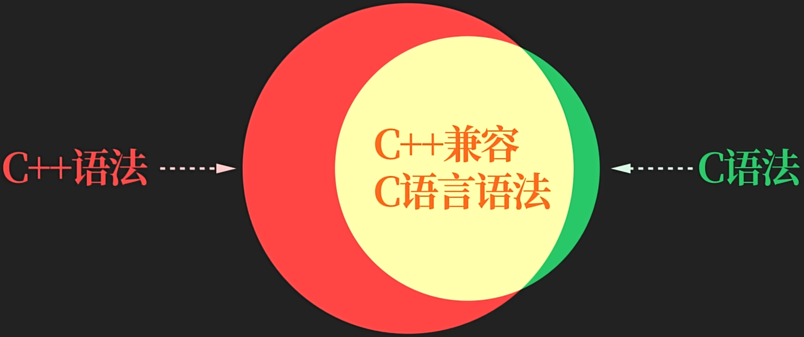

C 程序结构


使用C++源文件可编译C语言代码

 

```c
//输出 "Hello, World!"

#include <stdio.h>

int main()
{
   printf("Hello, World! \n"); 
   return 0;
}
```
 ```c
//主函数
int main()  //main:表示一个主函数
{
  //主函数返回值  注释：标注代码用途和思路
  return 0;  //return:表示函数的返回值
}
 ```


# 函数

```c
返回值类型 函数名(输入参数)
{
  处理一些事情
  return 函数返回值;    
}
```


# 主函数

* 所有C语言代码都有起始入口，即 主函数main
* 进入主函数后，才能由主函数调用其他函数
* 每个C语言代码，有且只能有一个主函数

1. 主函数被自动调用
2. 返回值给调用的程序
3. 主函数返回值必须为int


# C 程序的基本结构


* 预处理器指令：如 `#include` 和 `#define`

* 主函数：至少有一个 `main()` 函数，程序从这里开始执行

 

* 变量声明：声明程序中使用的变量

* 函数定义：定义程序中使用的函数


# 编译&执行 C 程序

调试代码，如果代码中没有错误，生成  .exe 可执行文件。

运行