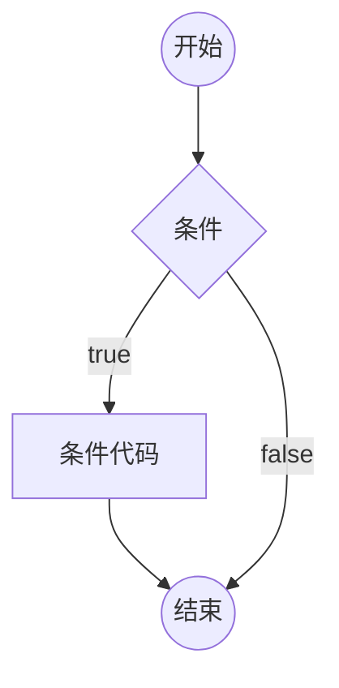

判断





# if判断语句

```
if (逻辑表达式)
{
	语句体1
}
else
{
	语句体2
}
```

若逻辑表达式为真，执行语句体1，否则，执行语句体2. else可不要


# switch判断语句

```
switch (变量)
{
	case 常量1 : 语句体1; break;
	case 常量2 : 语句体2; break;
	default: 语句体3; break;
}
```

将变量与case后的各个常量对比，若相等，则执行相应的语句体，否则，执行default后的语句体。default可不要

