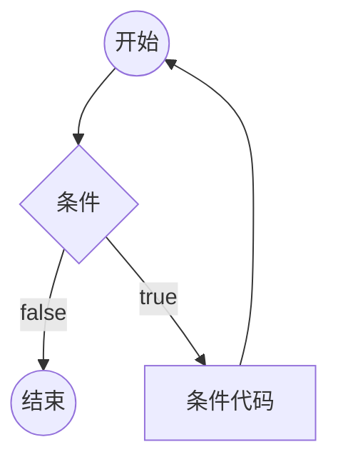

循环





# for循环语句

```
for (初始化；逻辑表达式；更改条件)
{
	循环体;
}
```

先执行初始化，再判断逻辑表达式，若成立，则执行循环体，再更改条件，再判断逻辑表达式，直到表达式不成立


# while循环语句

```
while (逻辑表达式)
{
	循环体;
}
```

若逻辑表达式成立，则执行循环体，再判断逻辑表达式，直到表达式不成立


# do...while循环语句

```
do {
	循环体;
} while(逻辑表达式)
```

先执行循环体，再判断逻辑表达式，直到表达式不成立


# 无限循环语句

```
//for无限循环
for (;;)
{
	循环体;
}

//while无限循环
while(1)
{
	循环体;
}
```


# 循环控制语句

改变代码的执行顺序。可以实现代码的跳转

## break语句

1. 在循环内，立即终止循环，且程序流将继续执行紧接着循环的下一条语句。
2. 在switch语句case内，终止该case，且程序流将继续执行紧接着该case的下一条语句。


## continue语句

跳过当前循环体，重新开始下一次循环迭代

* 对for循环，continue语句执行后自增语句仍然会执行
* 对while和do...while循环，continue语句重新执行判断条件语句

 