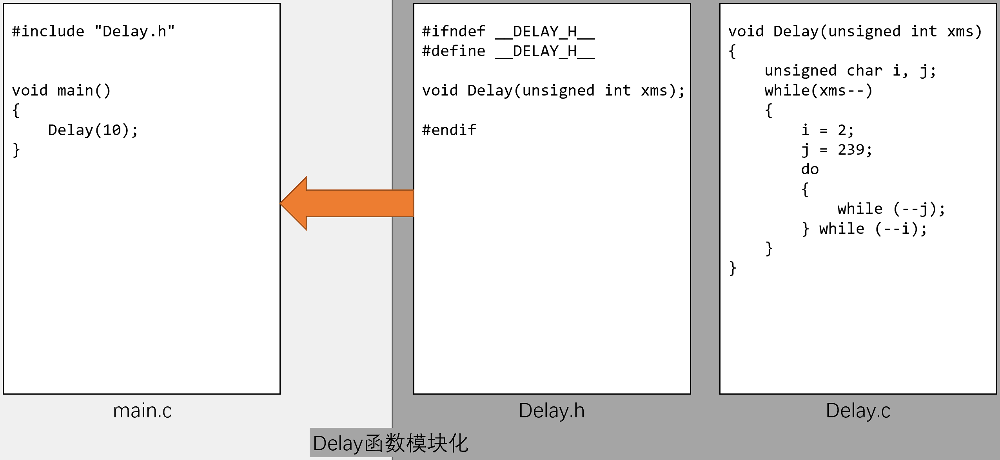
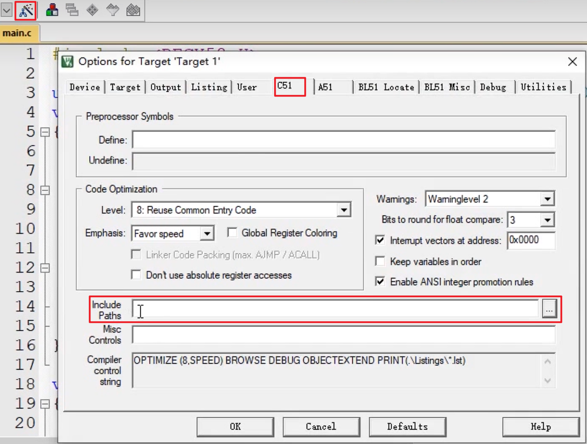

# 模块化编程与传统编程的区别

* 传统方式编程：

  所有的函数均放在main.c里，若使用的模块比较多，则一个文件内会有很多的代码，不利于代码的组织和管理，而且很影响编程者的思路

* 模块化编程：

  把各个模块的代码放在不同的.c文件里，在.h文件里提供外部可调用函数的声明，其它.c文件想使用其中的代码时，只需要#include "XXX.h"文件即可。使用模块化编程可极大的提高代码的可阅读性、可维护性、可移植性等

* 


# 模块化编程框图

 

## .h文件基本结构：

```c
/*如果未定义 __DELAY_H__ ，则继续执行，定义 __DELAY_H__ ，编译 函数、变量声明
	作用：防止重复包含，只会编译一次 */
#ifndef __DELAY_H__ //如果未定义 __DELAY_H__
#define __DELAY_H__ //定义 __DELAY_H__
	函数、变量声明; //参与编译
#endif

```


## 一个模块中多个功能的选择：

```c
/*如果定义 __DELAY_H__ ，编译 函数、变量声明 ，否则不编译
	如果一个模块有很多功能，可使用此结构，达到
	* 选择需要的功能，
	* 程序代码的精简化，
	* 不使用的功能不参与编译，节约空间 */

//#define __DELAY_H__  //定义 __DELAY_H__  【此行生效时，函数、变量声明 参与编译，否则不编译】

#ifdef __DELAY_H__  //如果定义 __DELAY_H__
	函数、变量声明; //参与编译
#endif

```


# 注意

* .c 文件：函数、变量的定义
* .h 文件：可被外部调用的函数、变量的声明


* 任何自定义的变量、函数在调用前必须有定义或声明 (同一个 .c )

* 使用到的自定义函数的 .c文件 必须添加到工程参与编译

* 使用到的 .h文件 必须要放在编译器可寻找到的目录 (工程文件夹根目录、安装目录、自定义)

   

* 


# C 预编译

C语言的预编译以#开头，作用是在真正的编译开始之前，对代码做一些处理（预编译）

| 预编译                | 意义                                   |
| --------------------- | -------------------------------------- |
| `#include <REGX52.h>` | 把 `REGX52.h` 文件的内容搬到此处       |
| `#define PI 3.14`     | 定义 PI ，将PI替换为 3.14              |
| `#define ABC`         | 定义 ABC                               |
| `#ifndef __XX_H__`    | 如果没有定义 `__XX_H__`                |
| `#endif`              | 与 `#ifndif` , `#if` 匹配，组成“括号”: |

此外还有#ifdef,#if,#else,#elif,#undef等

* 预编译中`#include <REGX52.h>` `<>` 与 `""` 的区别：

  `<>` 优先在安装目录中寻找 .h文件

   `""` 优先在工程根目录中寻找 .h文件

* 


# 宏定义

关键字：#define

用途：用一个字符串代替一个数字，便于理解，防止出错；提取程序中经常出现的参数，便于快速修改

定义宏定义：

​        \#define ABC 12345

引用宏定义：

​        int a = ABC;    //等效于int a = 12345;


# typedef

关键字：typedef

用途：将一个比较长的变量类型名换个名字，便于使用

定义typedef：

​        typedef unsigned char uint8_t;

引用typedef：

​        uint8_t a;    //等效于unsigned char a;


# 结构体

关键字：struct

用途：数据打包，不同类型变量的集合

定义结构体变量：

​        struct{char x; int y; float z;} StructName;

​        因为结构体变量类型较长，所以通常用typedef更改变量类型名

引用结构体成员：

​        StructName.x = 'A';

​        StructName.y = 66;

​        StructName.z = 1.23;

   或 pStructName->x = 'A';    //pStructName为结构体的地址

​        pStructName->y = 66;

​        pStructName->z = 1.23;


# 枚举

关键字：enum

用途：定义一个取值受限制的整型变量，用于限制变量取值范围；

​    宏定义的集合

定义枚举变量：

​        enum{FALSE = 0, TRUE = 1} EnumName;

​        因为枚举变量类型较长，所以通常用typedef更改变量类型名

引用枚举成员：

​        EnumName = FALSE;

​        EnumName = TRUE;