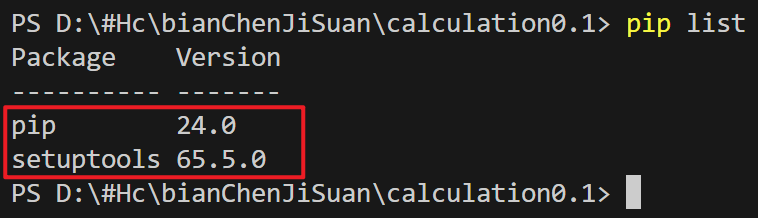

# Python 将脚本打包成可执行程序

1. 编写代码、并调试运行正常，需要的打包的内容放在一个文件中

2. 创建一个虚拟环境(打包的文件体积会小很多)


   * 新建虚拟环境  `python -m venv venv`
    
   * 修改解释器为虚拟环境 (VScode)
     
     .png) 
    
   * 重启终端，使虚拟环境生效 ( `pip list` 可检测是否生效，虚拟环境下只有基础的Python库)
     
      
    
   * 安装 本脚本使用的库

3. 安装 pyinstaller

   ```
   官方源
   pip install pyinstaller
   
   清华源 (速度快)
   pip install PyInstaller -i https://pypi.tuna.tsinghua.edu.cn/simple
   ```

4. 执行打包 `pyinstaller -w -F calculation.py`

​        注意：有些第三方工具不能打包！


 


参考：

[Python pyinstaller打包exe最完整教程-CSDN博客](https://blog.csdn.net/qq_48979387/article/details/132359366)

[python代码打包exe文件和里面坑_哔哩哔哩_bilibili](https://www.bilibili.com/video/BV15i4y1U7F7/?spm_id_from=333.999.0.0&vd_source=b6cd6dd41c0769968f58ce886d249f74)      